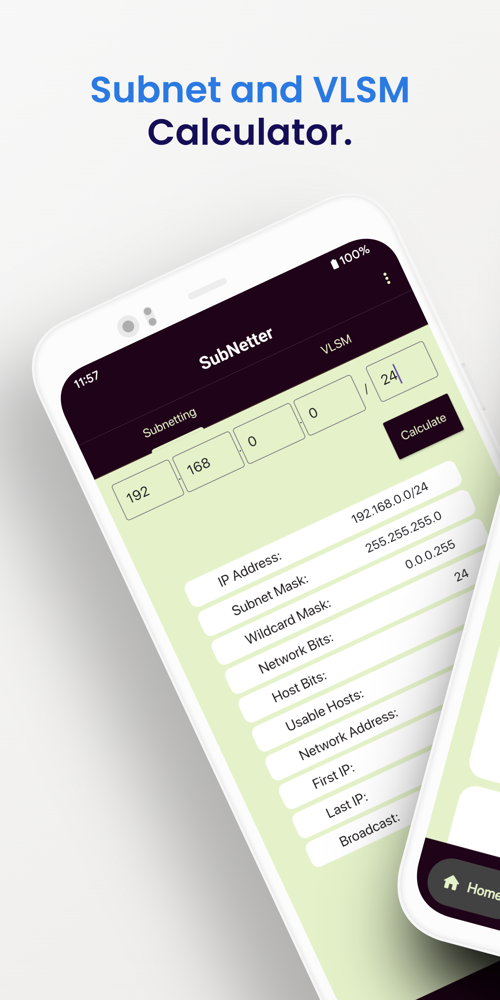
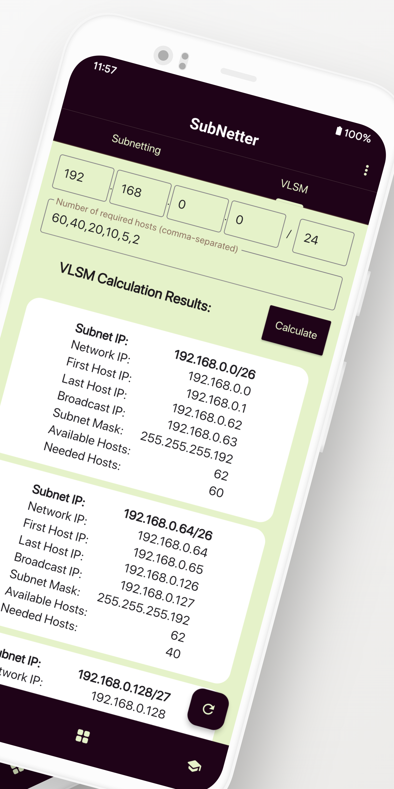
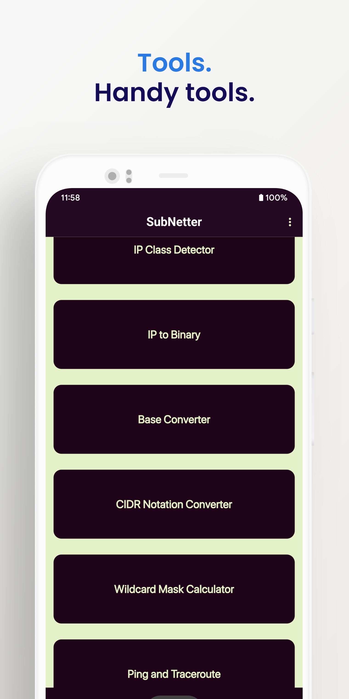
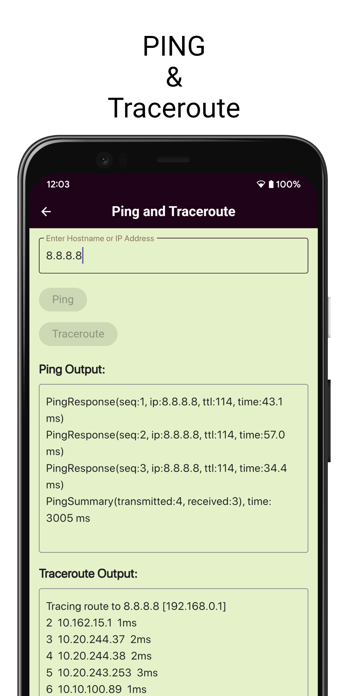
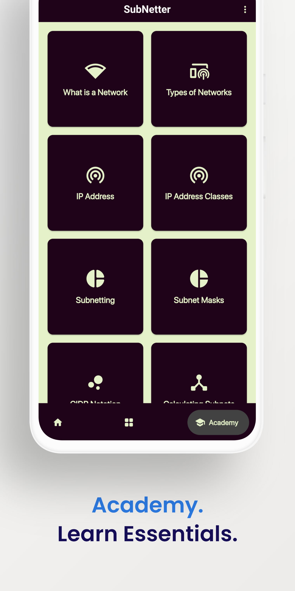
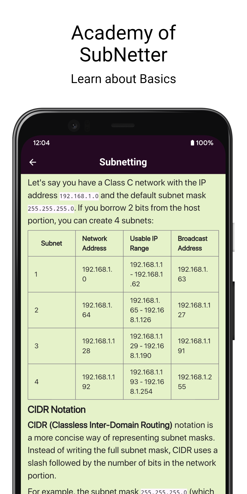

Subnetter is a versatile subnet and VLSM (Variable Length Subnet Masking) calculator, available as both a command-line tool and an Android app. It is designed to simplify IP address management for network administrators, IT professionals, students, and anyone working with networks.
### Features:

* **Command-Line Interface (CLI):**
    - Accurate subnet and VLSM calculations.
    - Supports custom subnet sizes.
    - Clear and organized output.
    - Optional table format output using the `tabulate` library.

* **Android App:**
    - User-friendly graphical interface.
    - Additional tools, including CIDR Notation Converter, Wildcard Mask Calculator, Ping, and Traceroute. 
    - Interactive "Subnetter Academy" with lessons and quizzes to help you master networking fundamentals.

### Motivation:

I created SubNetter because I was frustrated with the lack of user-friendly and feature-rich subnet calculators. I wanted a tool that was both powerful and accessible, whether you're a seasoned network engineer or a student just starting out.

### Technology Stack:

- Python (for CLI)
- Flutter (for Android App)

### Check out the project:

#### GitHub Repository:  

  
  [https://github.com/0xShakhawat/subnetter](https://github.com/0xShakhawat/subnetter)

#### Play Store App:   

[https://play.google.com/store/apps/details?id=me.shakhawat.subnetter](https://play.google.com/store/apps/details?id=me.shakhawat.subnetter)  

### Screenshots
#### Command-Line Interface (CLI):  


#### Android App:  

  
  
  
  
  
  

